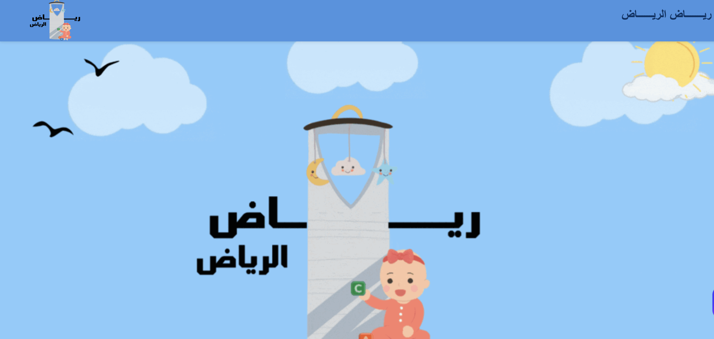

# Riyadh-Nurseries | ريــاض الريــاض

## Project Overview 
**Riyadh-Nurseries** is an interactive web application designed to simplify the nursery selection process for parents in Riyadh. Choosing the right nursery is a critical decision, and our platform empowers parents with the tools they need to make informed choices based on safety, educational quality, care, and user sentiment.

---

## 🛠️ Tech Stack  
- **Python** — Core language for backend and data processing  
- **Jupyter Notebook** — Data exploration, cleaning, and modeling  
- **NLP & AI Models**  
  - **BERT** — For understanding and processing nursery reviews  
  - **Sentiment Analysis** — Gauges overall parent satisfaction  
- **Web Scraping** — Automated data collection from public nursery listings  
- **Streamlit** — Frontend framework for building the interactive web app  
- **JavaScript** — For enhancing UI responsiveness and interactions  

---

## Key Features  
- **Advanced Nursery Search** — Filter by location, fees, ratings, and more  
- **AI-Powered Review Analysis** — NLP-driven insights from parent feedback  
- **Interactive Dashboard** — Visual exploration of nursery data  
- **Sentiment Trends** — See how nurseries perform based on user sentiment  

---

##  Live Demo  
Try it now 👉 [Riyadh-Nurseries on Streamlit](https://capstone-project-11.streamlit.app/)  

---

## Target Audience  
Parents in Riyadh seeking reliable, data-driven guidance to choose the right nursery for their child.

---

## 👥 Team  
- Emtnan Alomireni  
- Rahaf Alotaibi  
- Mushal Alshagha  
- Zaid Alkhathlan  
- Suliman Alghanmi  
